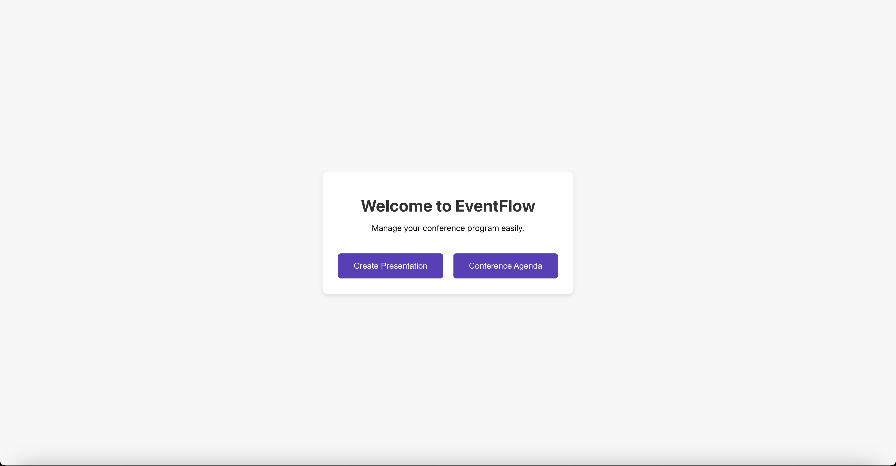
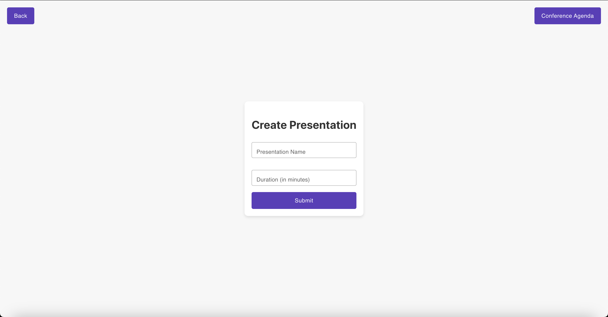
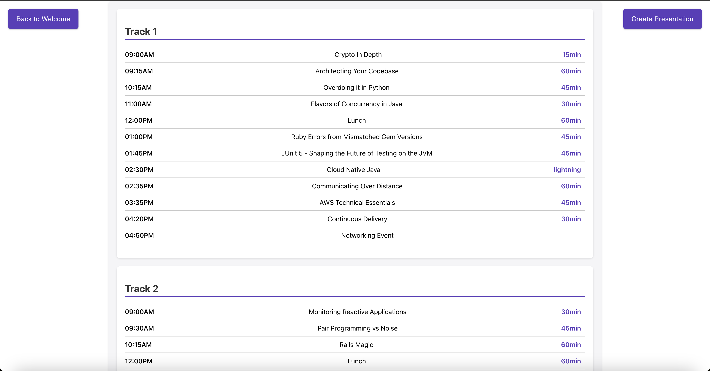

# EventFlow Frontend

EventFlow Frontend is a dynamic web application designed to manage and display conference agendas. Built with React, it offers a user-friendly interface for viewing and interacting with various conference tracks and presentations.

## Features

- **Dynamic Agenda Viewing**: Allows users to view different tracks of a conference, including presentation details like start times, names, and durations.
- **Responsive Design**: Crafted to provide a seamless experience across various devices.
- **Interactive Components**: Users can navigate through the application, create presentations, and more.
- **Real-time Data Fetching**: Integrates with backend services to fetch and display up-to-date agenda information.

## Getting Started

To get a local copy up and running, follow these simple steps:

### Prerequisites

- Node.js
- NPM

### Installation

1. Clone the repo
   ```sh
   git clone https://github.com/berkbuyukdurak/eventflow-frontend.git

2. Install NPM packages
   ```sh
   npm install

3. Set up the environment variables by creating a .env file based on the .env.example.

### Running the Application
1. To start the application, run:
   ```sh
   npm start
2. Open http://localhost:3000 to view it in the browser.

## Project Structure
- src/pages: Different pages of the application.
- src/services: Services for API calls and data management.
- src/config: Configuration files for routes and other settings.
- public: Public assets like HTML files, images, etc.

## Technologies Used
- React.js
- Material-UI

## Screenshots

### Landing Page


### Create Presentation


### Conference Agenda

